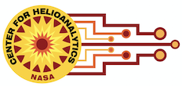
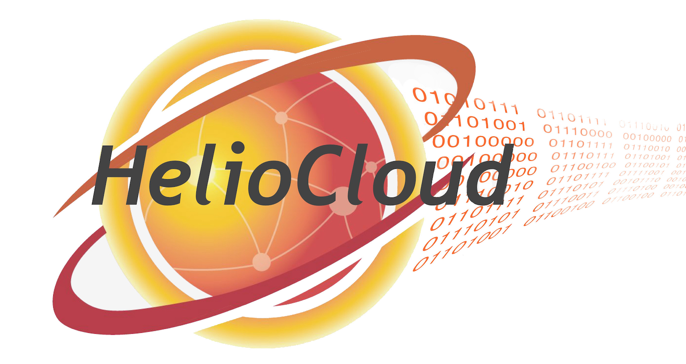

#  PyHC 2024 Summer School
## Machine Learning Tutorial

Brought to you by: 

This series of tutorials is part of the <a href="https://heliopython.org/summer-school-24/">2024 
Python in Heliophysics Summer School</a> held May 20-24, 2024.

### Machine Learning Tutorial Course Materials

| Session    | Lecture Topic                         |  Link    |  Timing    |
|------------|------------------------------------------------|------|---------|
| Session 1  | **Introduction**                               |      |  |
| Session 1A | **What is Machine Learning?**                  |  <a href="/aiml-tutorial/CourseMaterials/Introduction.md">Link</a>    | 15 min. |
| Session 1B | **How does Machine Learning work?**                 |  <a href="/aiml-tutorial/CourseMaterials/models.md">Link</a>    |  15 min. |
| Session 2  | **Examples: ML Models**                           |      |         |
| Session 2A | **Clustering** | <a href="/aiml-tutorial/CourseMaterials/clustering_simple.ipynb">Link</a>   |   20 min. |
| Session 2B | **Decision Boundary**                                           | <a href="/aiml-tutorial/CourseMaterials/Boundary_simple.ipynb">Link</a>   |   20 min. |
| Session 2C | **Decision Boundary using TensorFlow**                                              | <a href="/aiml-tutorial/CourseMaterials/Boundary_TensorFlow.ipynb">Link</a>   |   20 min. |
| Session 2D | **Classifier**                                              | <a href="/aiml-tutorial/CourseMaterials/Classifier_example.ipynb">Link</a>   |   20 min. |
| Session 3  | **Data Science Workflow**                           |  <a href="/aiml-tutorial/CourseMaterials/Data_Science_Lifecycle.md">Link</a>  |   15 min. |

##  Use and Dependencies
These materials were developed for the summer school students, but are intended to function as stand-alone lessons freely to be used by anyone.  

The lessons use the following packages:  numpy, pandas, matplotlib, and tensorflow (keras).  

##  Acknowledgments 
These course materials were developed by the <a href="https://helioanalytics.io"> Center for HelioAnalytics (CfHA)</a> with the support of funding from NASA. We request that any subsequent use acknowledge CfHA. 

The course materials were derived in part from the <a href="https://github.com/HelioAnalytics/EPSCOR_Hackweek/">2022 NASA EPSCOR Hack Week</a> hosted by West Virginia University. 

<B>In adddition to the Center for HelioAnalytics team members, we want to acknowledge the following authors for their major contributions to these course materials: </B>  
Evana Gizzi, Ph.D., AI Researcher NASA GSFC</i> 
Richard Licata, Ph.D., Data Scientist, CACI International</i> 

## Additional Resources

### Books and texts 
- "The Python Data Science Handbook" by Jake VanderPlas https://jakevdp.github.io/PythonDataScienceHandbook/ 
- "HelioML: Machine Learning, Statistics, and Data Mining for Heliophysics" by Monica Bobra and James Mason https://helioml.org/

### Online articles 
- "Towards Data Science" has many articles for beginners to advanced levels on coding and development:  https://medium.com/towards-data-science/
- "KD Nuggets" was started by a space scientist turned data scientist (Kirk Borne). A great way to keep up on what's happening in data science:  https://www.kdnuggets.com/ 

