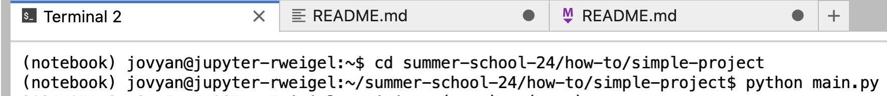
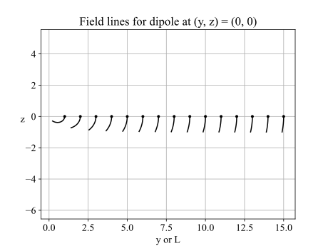

This is a minimal repository that has features recommended for a small project. These features are described in the PyHC 2024 Summer School ["How-To"](https://docs.google.com/document/d/1PntLwlVvPJiMEZ6hoTtuvqOG2OzufMq5_7nWxr8lbfY/edit#heading=h.22h0gh3t8dul) session.

The size and complexity of this project are at the threshold of where it makes sense to create a package and generalize and refactor the code.

# Install and Run

There are three options. I will use the first.

## Option 1: HelioCloud - Command Line

If running on a PyHC 2024 Summer School HelioCloud instance, open a terminal from the launcher tab (see below)

<details closed>
<summary>Opening a terminal in HelioCloud</summary>
(If you do not see a Launcher tab, click the +.)
<br>    

<br>    

</details>

```
python main.py # creates main.log; see switches at top of file for options
python plot.py # creates figures/field_lines.{pdf,png,svg}
```

## Option 2: HelioCloud - Notebook

You can run as a Jupytext Notebook by right clicking, selecting "Open With" and then "Jupytext Notebook".


## Option 3: Laptop

Open a terminal and enter

```
git clone https://github.com/heliophysicsPy/summer-school-24
cd summer-school-24/how-to/simple-project
pip install scipy matplotlib
python main.py # creates main.log; see switches at top of file for options
python plot.py # creates figures/field_lines.{pdf,png,svg}
```

# Overview

This repository contains code for experiments involving the comparison of field line tracing algorithms and the visualization of field lines. Packages exist for field line tracing (see [Related](#Related)), but to simplify the experiment and interpretation of results, we do not use them.

The two primary functions in [`main.py`](main.py]) are `compare()` and `generate()`.

* `compare()` is used to determine how the location of the equatorial crossing of a dipole field line depends on the integration algorithm. The motivation is that when many field lines must be traced, we want to use the most efficient solver that provides solutions within some error bounds. Here, we only report on the results of the choice of integration algorithm. Other factors influencing the solution are the settings for relative and absolute tolerances.

  `compare()` uses SciPy's [`solve_ivp`](https://docs.scipy.org/doc/scipy/reference/generated/scipy.integrate.solve_ivp.html) to compute using `RK23` and `RK45`.

* `generate()` creates field lines that can be plotted by executing [`plot.py`](plot.py).

# `compare()` results

A [dipole field](https://ccmc.gsfc.nasa.gov/RoR_WWW/presentations/Dipole.pdf) of

$B_y = 3yz/r^5$

$B_z = (3z^2 - r^2)/r^5$

and the default absolute and relative tolerances for `solve_ivp` were used with a stop criteria of $z = 0$.

For a field line trace that starts at $(y,z)=(1,1)$, the algorithms stop at

```
RK23: y = 2.834630 z = -6.94e-17
RK45: y = 2.831050 z =  1.11e-16
```

The difference in $y$ between the two algorithms corresponds to a difference of `23 km` if the length scale of $r$ is Earth's radius, $6371$ km.

Additional reporting information generated by `compare()` is shown in [`main.log`](main.log).

# `generate()` results

The function `generate()` creates five field lines of length 2. After executing `main.py`, execute `plot.py` to see the results, which are shown below.



# Appendix

## Related

* https://streamtracer.readthedocs.io/en/stable/
* https://psipy.readthedocs.io/en/stable/guide/tracing.html - Example of visualization using PyVista
* https://spacepy.github.io/autosummary/spacepy.pybats.trace2d.html
* https://spacepy.github.io/autosummary/spacepy.irbempy.find_footpoint.html
* https://book.magneticearth.org/geomag-obs-models/03a_magnetic-field-line-tracing
* https://github.com/CosmicStudioSoftware/OMMBV
* https://pypi.org/project/FieldTracing/
* https://github.com/mattkjames7/PyGeopack
* [Effective-Tracing-of-Magnetic-Field-Lines.pdf](https://www.researchgate.net/profile/Francesco-Pizzo-3/publication/278537980_Effective_Tracing_of_Magnetic_Field_Lines/links/5631fe3608ae0530378d9247/Effective-Tracing-of-Magnetic-Field-Lines.pdf)

## TODO

1. Use `events` to stop field line trace when field line hits `r=1`.
2. Add option to use field from SpacePy. See [spacepy_field.py](spacepy_field.py) for example use of SpacePy for computing a magnetic field from a model.
3. Allow user-selection of resolution of points along field line reported (`s_eval`).
4. Mirror field lines around $z=0$ in plots.
5. Add test using spherical representation comparison with cartesian form used.
6. Document related links
