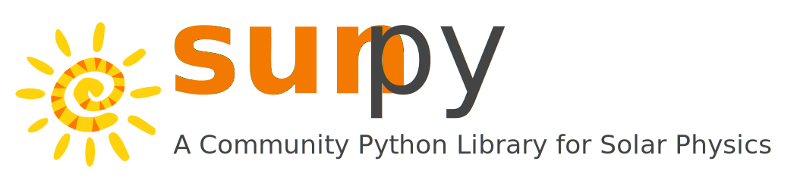
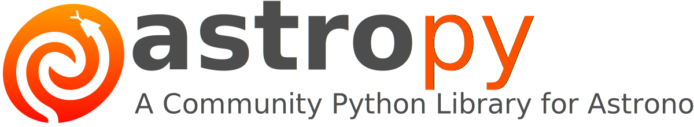

# **An introduction to sunpy (and astropy)**

## PyHC Summer School 2024

### *Will Barnes* (AU/NASA GSFC) and *Nabil Freij* (BAERi/LMSAL) *on behalf of the SunPy Community*

### *with many thanks to: Albert Shih, Laura Hayes, David Stansby, Stuart Mumford, Pey Lian Lim, Erik Tollerud, Larry Bradley, Tim Pickering, Tom Aldcroft, David Shupe and Brett M. Morris**
